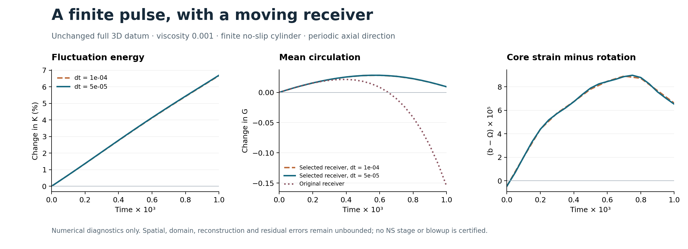

<!-- DRAFT for the author's copy pass. Working title. Delete this line to publish. -->

# A Forced Route to Clay

**On 8 September 2026 two mathematicians posted finite-time blowup for 3D Euler with a smooth force, Lean-certified, and a four-page statement relaying a second-hand claim that the same had been done for full Navier–Stokes. Here's some proof that the released mechanism can never get there. I also put every axisymmetric attempt on the axis at a Type II rate, performed a certificate line by line, rebuilt it, and closed a factor of e³⁴ in our own clock.**

Roughly sixteen hours. All here: Proofs, synthetic referee reports, the scripts every number came out of, the Lean, and the parts I could not close.

**What we are claiming.** The released family of forced-blowup constructions, as released and however tuned, cannot produce a Navier–Stokes singularity: Lemma A proves it for every dissipation order above one, and the family is bounded in velocity by design. Any axisymmetric solution of Fefferman's option (C) that blows up does so on the axis, faster than the self-similar rate, with swirl. The three published Lean certificates are sound and certify strictly less than the papers say. The vorticity doubling clock for a vortex ring has the form c₂(1+ε)/(M log Re) with c₂ = 1.629, assembled to an explicit list of remaining items. And for unforced Navier–Stokes at viscosity one over a thousand we hold certified initial feedback, a finite gain theorem on a real solution, and an obstruction that reshaped the search.

**Scope.** Boundary captured in [`docs/evidence-status.md`](docs/evidence-status.md).

**Latest addendum.** [Pass12](core-line/outputs/euler-ns-transfer/pass12/REPORT.md) adds a reference driven to the actual flow, repairs a gradient passage under explicit solution assumptions, and reconstructs the numerical endpoint on the whole space. The [dated scope review](docs/pass12-scope-update.md) distinguishes those results from the clock addendum's broader closure labels.

---

## In one screen

| What | Status | Where |
|---|---|---|
| **Lemma A.** Bounded velocity continues, for every dissipation order above one. The released cascade family is bounded in velocity, so it is shut out of Navier–Stokes, force or no force. | Proved. Three-lens referee, 20 corrections applied at source. | [`theorems/01_two_fences.md`](theorems/01_two_fences.md) |
| **Lemma B.** Axisymmetric full-NS singularities lie on the axis, with forcing. Their torus construction sits off it. | Assembled from CKN; rotation step proved. | same |
| **Theorem.** In the axisymmetric sub-class of Fefferman's (C): on the axis, Type II, swirl required. | Proved under the strong-solution class (H*). Refereed; 11 corrections. | [`theorems/02_…`](theorems/02_forced_axisymmetric_on_axis_typeII.md) |
| **Ceiling of the layered cascade.** Amplitude-model ceiling 1/2; the released schedules send it to zero; a smooth force and a fixed dissipation exponent cannot coexist in the released correction scheme. | Model analysis, refereed. Not a theorem about all mechanisms. | [`analysis/01_…`](analysis/01_dissipation_ceiling_of_the_layered_cascade.md) |
| **Certificate audit.** Their three Lean statements: no loopholes; sound but undocumented weakenings; no hash binds paper to repo. | 33 independent readers, two refuters per finding. | [`audit/01_…`](audit/01_lean_statement_audit.md) |
| **The log clock.** Vorticity doubling time ≤ c₂(1+ε)/(M log Re), c₂ = 1.629, matching the lower bound already on record. Would make a published log-free bound false as stated. | Written end to end; remaining items enumerated, two discharged the same day. | [`theorems/03_log_clock/`](theorems/03_log_clock/THEOREM_S3/THEOREM_S3.md) |
| **The strained core.** Unforced NS at ν = 1/1000: certified initial pressure feedback, a finite receiver-gain theorem, a numerical lead at −241, the circulation obstruction, twelve passes. | Finite results retain their individual proof/check scopes. The historical second-host 94/94 reproduction covers passes2–9. Later evolution and reconstruction remain diagnostics; persistence and return are open. | [`core-line/`](core-line/outputs/euler-ns-transfer/REPORT.md), [`strained-core/`](strained-core/REPLICATION.md) |
| **The reconstructed endpoint.** An H4-compatible C4 reference, a center-independent gradient estimate, and a compact C6/H7 potential fit retaining the exact initial datum. | Conditional mathematical estimates and checked reconstruction diagnostics. A sampled fit failed; the corrected continuous-L2 fit still needs full time-slab residual and error bounds. | [Pass12](core-line/outputs/euler-ns-transfer/pass12/REPORT.md) |
| **Lean.** 91 theorems, standard axioms, green build in two minutes. The elementary cores of everything above. | No PDE formalized. | [`lean/`](lean/README.md) |
| **The independent Euler rebuild.** Mathlib from source on a 2019 laptop, then the project. | The dated capture remains incomplete; no final build, axiom output or comparator replay is recorded. | [Build-log update](docs/external-replication-update.md), [`replication/`](replication/README.md) |

---

## Previews

**The fence that decides the race.** Write the dissipation as `|∇|^α`. Under `u_λ(x,t) = λ^{α−1} u(λx, λ^α t)` the sup norm scales like `λ^{α−1}`, so bounded velocity is critical exactly at `α = 1` and has room to spare above it. The energy estimate closes when Young's inequality can absorb the nonlinearity, which happens iff `θ = (2−α)/α < 1`:

```lean
theorem theta_lt_one_iff {α : ℝ} (hα : 0 < α) : theta α < 1 ↔ 1 < α := by
  rw [theta, div_lt_one hα]
  constructor <;> intro h <;> linarith
```

Córdoba, Martínez-Zoroa and Zheng's hypo-dissipative solutions are bounded in velocity, in their own words. So is the released Euler construction. Navier–Stokes is `α = 2`.

**The fence that fixes the geometry.** Rotate a singular point about the axis and you get a circle; a circle has positive one-dimensional measure; Caffarelli, Kohn and Nirenberg say the singular set has none. So an axisymmetric singularity sits on the axis.

```lean
theorem hausdorffMeasure_circle_pos {r₀ : ℝ} (hr₀ : 0 < r₀) :
    0 < μH[(1 : ℝ)] {x : Pt | x 2 = 0 ∧ (x 0) ^ 2 + (x 1) ^ 2 = r₀ ^ 2}
```

**The window every fence leaves open.** A cascade whose velocity grows like `q^{−(1+a)}` per stage, with advective stage times, beats the self-similar rate iff `a > 0`, and keeps finite energy iff `a < 1/2`. The strained-core line runs at `a = 1/4`.

```lean
theorem advective_exponent_gt_half_iff {a : ℝ} (ha : -2 < a) :
    1/2 < (1 + a)/(2 + a) ↔ 0 < a
```

**The core pressure, coefficient by coefficient.** For the compact strained core `L = diag(−b,−b,2b) + Ω J`, the axial pressure curvature is `−(18/7) b² + (2/5) Ω²`. The note said the profile dependence cancels. Lean says it is a theorem, for every cutoff profile in the class, because the profile moments cancel under integration by parts:

```lean
theorem strain_radial :
    (1/2) * (∫ s in (0:ℝ)..c.T, (16/105) * (-4 * (s ^ 2 * c.psi1 s * c.psi2 s)
        + 6 * (s * c.psi s * c.psi2 s) + 2 * (s * c.psi1 s ^ 2)
        + 21 * (c.psi s * c.psi1 s))) = -(4/7)
```

Every theorem in `lean/` prints `[propext, Classical.choice, Quot.sound]` and nothing else ([`lean/AXIOMS.txt`](lean/AXIOMS.txt)).

**The clock, as it would read.** For a tapered, mollified vortex ring of amplitude `M` and shell aspect ratio `L = log(R/ρ₀)`, the first time the vorticity maximum reaches `3M/2` satisfies

```
M · T_d  ≤  c₂ (1 + ε(L)) / (2L),      c₂ = 2 log(3/2) / κ_δ = 1.6289547
```

for `L` above an explicit threshold. The assembly is written end to end, with the remaining items enumerated in the [addendum](theorems/03_log_clock/THEOREM_S3/ADDENDUM_1_2026-09-08.md) and the [cross-review](docs/cross-review-clock-line.md); two of them fell the same afternoon, and the five bookkeeping items from the cross-review were repaired by evening. What moved: an `e^{34}` feedback exponent in the bootstrap turned out to be an artifact of a reference strain fixed in advance; defining the reference from the true solution removes it as an identity, and the amplification becomes 3.4.

**The lead.** For one explicit smooth compact datum at `ν = 0.01`, the derivative that decides whether strain grows against rotation:

```
p_zz'(0) + 32  ≈  −241.35   (split representation)
                 −241.42   (source representation)
```

Negative is favorable. Reproduced on a second host to the digit. It is the first gate of a cascade, and it is open.



*Pass 11: the complete compact datum evolved in a finite cylinder through T = 0.001. A diagnostic, not a whole-space enclosure.*

---

## Reproduce it

Ten minutes for the Lean, an afternoon for the checks, a day for their certificate.

```bash
# our 91 cores (Lean 4.33.1, Mathlib pinned; never build Mathlib from source)
cd lean && lake exe cache get && lake build && lake env lean Axioms.lean

# the strained-core checks, pass by pass (python3 + numpy/scipy/sympy/mpmath)
cd strained-core/work/pass4 && python3 run_checks.py

# their Euler certificate, as we ran it (Mathlib from source; hours; see replication/README.md)
cd fluid_lean/euler-blowup && lake build && lake env lean scripts/PrintAxioms.lean
```

Every number in every note came out of a script checked in beside it, with a `SHA256SUMS`. The [reproduction guide](docs/reproduction.md) has the rest.

---

## How this was made

Two independent lines, blind to each other until the end. Every proof went to referees who saw neither the author's reasoning nor each other's, with the standing instruction to refute. Constants were never typed from memory. Sources were read at source, and when one could not be, the note says which secondary source it used. The two halves reviewed each other only after both had filed; the [scope review](docs/cross-review-clock-line.md) and the [expanded assessment](docs/cross-review-clock-line-expanded.md) are that exchange, unedited.

The one lesson we would tell anyone doing this: the verifier you want is Lean where the statement is elementary, and a blind referee with a script where it is not. Grades inside this repo are ours; the referee reports are how they were earned.

Longer version: [`EXPLAINER.md`](EXPLAINER.md).

---

## Map

| Path | What |
|---|---|
| [`theorems/`](theorems/) | the fences, the Type II theorem, the log clock, each with its referee report |
| [`analysis/`](analysis/) | the cascade ceiling; the event record |
| [`audit/`](audit/) | the certificate audit; source hashes |
| [`lean/`](lean/README.md) | 91 cores, axiom audit, build recipe |
| [`core-line/`](core-line/README.md), [`strained-core/`](strained-core/README.md) | the constructive line, passes 2–12, and the historical passes2–9 second-host replication |
| [`clock-line/`](clock-line/README.md) | the source campaign behind the clock line |
| [`replication/`](replication/README.md) | the independent Euler rebuild record |
| [`docs/`](docs/) | evidence status, research map, reproduction, provenance, the cross-reviews, the [archive guide](docs/ARCHIVE_GUIDE.md) |
| [`page/`](page/) | the publication page, in the OpenHell identity |

---

Hell Labs, a skunkworks division of Hudson Intelligence Laboratories. Think small.
