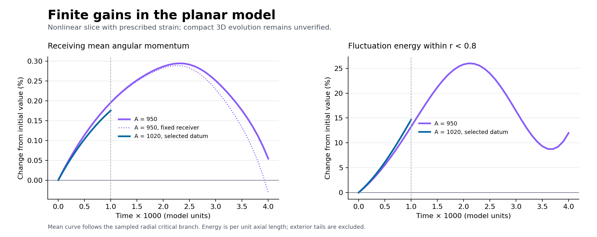

# Ninth pass: test a finite pulse and prepare full-field validation

8 September 2026. **The leading seed produces a finite gain in resolved
nonlinear planar calculations. Its actual three-dimensional initial receiver
also decelerates. A useful compact 3D stage and inherited return remain open.**

The selected next full-field test now uses the explicit datum
`u0=M+1020v+(1/4)w_L`, with viscosity `1/1000`. Its favorable initial core,
mean and energy inequalities are audited. An H4 residual estimate supplies
a route to validating retained endpoint gains without demanding positive
acceleration at every intermediate time. That residual has not been bounded
for a complete three-dimensional evolution.

## Actual NS results

The [general-envelope identity](general-envelope-jet.md) retains the steep
envelope, all nonlocal pressure, viscosity and pressure-generated axial
covariance. A [new pressure-gradient enclosure](general-envelope-jet-evaluation.md)
recomputes the leading seed's radial Green solution and both exterior tails;
its full pressure error is below 1.3. It proves, for the exact initial
receiving circle and the stated amplitude ranges,

- `11<G_t(0)<106` and `-101000<G_tt(0)<-13000`.
- Following the radial maximum at fixed packet-center axial height still
  gives initial value acceleration between `-101000` and `-12000`.

These are new-data results. They do not import the old trailing seed's jets,
bound the unrestricted global maximum, or give a turning time. Positive
initial perturbation-energy growth remains compatible with them.

The [explicit-amplitude calculation](fixed-amplitude-initialization.md) removes
implicit pressure retuning from the selected initial data. For `A=1020`,
the full off-neutral core formula gives `beta'(0)>0.02484` and
`beta''(0)>6.09`, where `beta=b/Omega`. At selected seed amplitude `1/4`,
the receiving mean derivative exceeds `102.49`; the previously certified
fractional perturbation-energy derivative remains above `5.829`.
The [independent audit](fixed-amplitude-independent-audit.md) checks the
off-neutral correction and every reused amplitude condition.
Choosing this amplitude is not a regenerated endpoint.

## Finite-time model evidence

The [nonlinear slice solver](experiments/evolve_circular_slice.py) evolves
the envelope, generated angular harmonics and mean feedback through planar
Biot–Savart inversion. It prescribes the affine meridional strain and omits
the compact axial endcaps, their three-dimensional pressure, the central
core and the older field.

At model time `0.001`, the selected `A=1020, lambda=1/4` run shows about
**0.175% gain in the tracked radial mean branch** and **14.6% gain in
fluctuation energy per axial length inside the numerical radius**.
Radial/time refinement changes the measured mean increment by less than
`0.0005` and the energy ratio by less than `0.001`. These are numerical
sensitivity observations, not certified continuum error bounds.

The longer `A=950` diagnostic reaches a sampled mean-gain peak near `0.0023`;
its torque then reverses, and by `0.004` the fixed initial receiver has lost
its net gain. The moving radial branch and fluctuation energy have different
histories. Later behavior for `A=950` is not a proved timing prediction for
the selected `A=1020` field.

Angular resolution and outer-boundary comparisons were performed at A=950;
the selected A=1020 has its separate radial/time refinement pair.
The [independent solver audit](slice-solver-independent-audit.md)
records the limitations: a tracked spline branch is not a proved global
maximum; energy excludes exterior tails; finite-radius energy balance has
boundary terms; and residual numerical mean circulation must be removed or
bounded before constructing a whole-space finite-energy approximation.

A separate [exact affine linear envelope theorem](affine-envelope-budget.md)
proves more than 15% energy gain at its named finite time, including viscosity,
and a finite positive shear-work budget. Its energy normalization and missing
nonlinear/cylindrical terms are explicit. It shows why a single carrier's
unwinding time cannot settle the whole packet's behavior, while supplying
no actual compact 3D stage or repeated energy source.

## What the next certificate must contain

The [validation bridge](evolution-validation-bridge.md) has an independently
[audited](evolution-validation-independent-audit.md) H4 endpoint route. For a
complete divergence-free approximation, it bounds actual error using its
whole-space vector residual, then charges that error to endpoint mean,
fluctuation energy, core cone, full velocity/Reynolds gain and inherited
profile. Initial, time-slab and rescaling errors are retained. An optional
H7 route also controls positive-time curvature, including the viscous core
terms absent from the initial neutral shortcut.

The next work is a full compact 3D approximation from the explicit selected
datum, a useful residual/error enclosure, and a successor class containing
its actual endpoint. Another initial sign, a planar pulse or a fresh packet
does not supply those missing estimates. No useful actual duration, return
map, compatible infinite construction or singular solution is established.

Run `python3 checks/run_checks.py` for eight finite programs, including two
recomputed interval certificates. The nonlinear production runs are stored
separately and are not silently rerun by that command.
[Verification](VERIFICATION.md) distinguishes their scopes.
